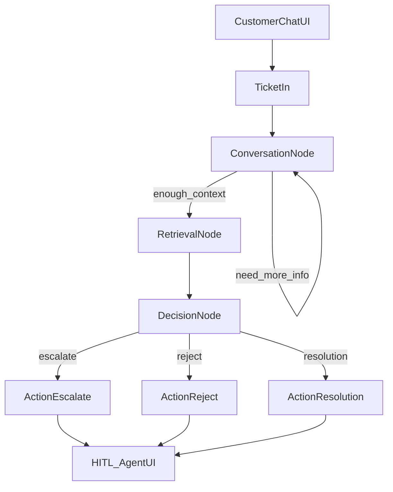
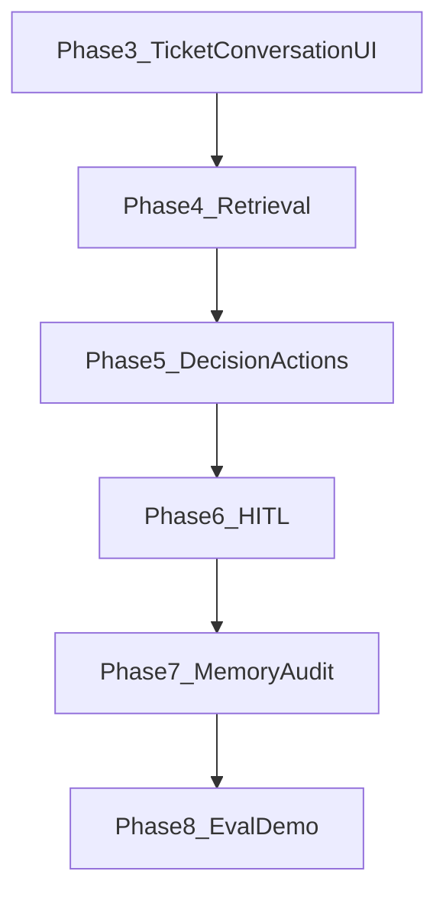

# Support Ticket Triage Agent — Updated Learning Plan

## Goal

Ship a **draft-only** ecommerce support agent for **Nimbus Home**. Ticket enters from a **customer chat UI**. LangGraph runs: **Conversation → Retrieval → Decision → Action (one of three) → HITL**. Replies are never auto-sent. Policies are quoted from the KB only.

Learning is the product: LCEL, LangGraph, Atlas retrieval, rerank, metadata filters, HITL, in-memory status queues.

## Done so far

- Phase 0 scaffold (configs, `src/`, DeepSeek/Mongo env)
- Phase 1 KB Markdown + chunking → `AI_KB.documents`
- Phase 2 BGE-small `embedd` (384) in place + Atlas `vector_index` on `embedd`
- Phase 3 TicketIn + Conversation + customer chat UI + in-memory status queue
- Phase 4 Retrieval: LLM expand → Atlas `$vectorSearch` + metadata/keyword BM25 → RRF top-N
- Sample CLIs: [src/retrieval/vector_search.py](src/retrieval/vector_search.py), [src/retrieval/run_pipeline.py](src/retrieval/run_pipeline.py)

## Locked decisions (updated)

- **Chat LLM**: DeepSeek (`ChatDeepSeek`) — recreate thin factory when graph needs it
- **Embeddings**: local `BAAI/bge-small-en-v1.5` (384-dim) — already used
- **Vector search**: **Atlas `$vectorSearch`** on `embedd` / index `vector_index` (no custom in-process KNN)
- **Status / message queue**: **in-memory** per ticket (asyncio/thread-safe queue) — no Redis, no Mongo queue
- **Confidence loop**: **removed** — if confidence is very low, attach a note on the HITL payload only
- **Frontends**: plain **HTML/CSS/JS** — (1) customer chat window, (2) human-agent HITL window
- **Domain / KB**: Nimbus Home ecommerce MD policies (already authored)

## Updated LangGraph (matches notebook)



Status events publish to an **in-memory queue** throughout; customer UI polls/SSE-reads them until the run finishes.

## Node contracts

### 1. Conversation node
- Input: ticket subject/message + chat turns
- Asks follow-up questions (order id, photos, dates, etc.) until enough context **or** max 2–3 clarifying turns
- Conditional edge: `need_more_info` → loop back to conversation; `enough_context` → retrieval
- Publishes status: `collecting_info`, `waiting_user`, `info_complete`

### 2. Retrieval node (single graph node, multi-step inside)
1. **Query expansion** on collected ticket context (DeepSeek LCEL)
2. **Atlas `$vectorSearch`** with expanded query embedding (`embedd`, `vector_index`)
3. **Metadata filter** combined when inferable (`category`, `policy_id`, `scope`) via `$vectorSearch.filter` and/or post-filter
4. **Rerank** candidates (cross-encoder or lightweight LLM score) → keep **top N** (config `final_top_k`)
5. Output: ranked chunks + citations for decision/action prompts
6. Publishes status: `expanding_query`, `searching`, `reranking`, `retrieval_done`

Reuse/extend [src/retrieval/vector_search.py](src/retrieval/vector_search.py); add expansion + filter + rerank modules under `src/retrieval/`.

### 3. Decision node
- Structured output: `escalate` | `reject` | `resolution` + confidence + rationale
- If **no escalation KB chunks** landed in retrieval, **inject escalation policy text** from [data/knowledge_base/escalation_criteria.md](data/knowledge_base/escalation_criteria.md) into the decision prompt explicitly
- Refuse/abuse paths map to **`reject`**
- Publishes status: `deciding`, `decision_ready`

### 4. Action nodes (three separate nodes; one runs via conditional edge)
- **ActionEscalate** — draft escalation packet / handoff note citing criteria
- **ActionReject** — polite refuse script grounded in `REFUSE-SCRIPTS` / policy
- **ActionResolution** — grounded customer reply with policy citations; if no usable policy → force escalate wording / route note (never invent)
- Each publishes status: `drafting_*`, `action_done`

### 5. HITL (human agent UI)
- Separate plain HTML/CSS/JS window for agents
- Shows draft, route, citations, confidence; if confidence **very low**, show a clear **low-confidence note** (no re-retrieve loop)
- Actions: approve / reject / edit / request regeneration / escalate
- On approve, result can be shown back in customer UI as “agent-approved draft” (still not auto-email)

## In-memory message queue (status updates)

- Per-`ticket_id` queue in process memory (`queue.Queue` or asyncio queue)
- Graph nodes `publish(ticket_id, {stage, message, ts})`
- Customer UI polls `GET /api/tickets/{id}/events` (or simple SSE) until `stage=complete` / HITL waiting
- Learning goal: queue concept without Redis ops burden

## Frontends + API

```
frontend/
  customer/     # chat window — ticket in, follow-ups, status feed
  agent/        # HITL review window
src/api/        # lightweight FastAPI (or Flask) bridging UI ↔ graph ↔ queues
src/graph/      # StateGraph definition + state schema
src/agents/     # conversation, decision, action_* node implementations
src/queue/      # in-memory status bus
```

Serve static HTML from the API process for local demo.

## Remaining build phases (graph top → bottom)

Phases follow the notebook flow: UI/TicketIn → Conversation → Retrieval → Decision → Actions → HITL, then memory/audit and eval.

### Phase 3 — TicketIn + Conversation + customer UI + status queue
- Minimal API + plain HTML/CSS/JS **customer chat** (ticket enters here)
- In-memory per-ticket status queue; UI polls/SSE for stage updates
- **Conversation node**: follow-up loop (max 2–3 turns) until enough context
- LangGraph stub: TicketIn → Conversation (loop) → (placeholder next)
- Publishes: `collecting_info`, `waiting_user`, `info_complete`

### Phase 4 — Retrieval node
- Wire Conversation output → Retrieval
- Query expansion LCEL on collected context
- Atlas `$vectorSearch` + metadata filter + rerank → top N
- Publishes: `expanding_query`, `searching`, `reranking`, `retrieval_done`
- Extend [src/retrieval/vector_search.py](src/retrieval/vector_search.py)

### Phase 5 — Decision + three action nodes
- **Decision node**: `escalate` | `reject` | `resolution` (+ confidence, rationale)
- Inject escalation policy into prompt when no escalation KB chunks retrieved
- Conditional edges to **ActionEscalate** / **ActionReject** / **ActionResolution**
- Grounded drafts only; refuse scripts → reject
- Publishes: `deciding`, `drafting_*`, `action_done`

### Phase 6 — HITL agent UI
- Separate plain HTML/CSS/JS **human-agent** window
- Show draft, route, citations; **low-confidence note** if needed (no re-retrieve loop)
- Approve / reject / edit / request regeneration / escalate
- Graph ends at HITL gate; customer UI can show “awaiting agent” / approved draft

### Phase 7 — Memory + audit
- Persist conversation/ticket thread turns
- Append-only audit under `outputs/audit/`

### Phase 8 — Eval + demo
- Synthetic tickets, expected routes, end-to-end demo, README



## Explicitly changed from earlier plan

| Old | New |
| --- | --- |
| Sentiment → RAG → route → confidence loop | Conversation → Retrieval → Decision → Action → HITL |
| Ask-clarification as a late route | Clarification happens first in Conversation node |
| Confidence re-retrieve loop | Dropped; low-confidence note on HITL only |
| CLI-only HITL | Separate HTML agent UI |
| No customer UI | Plain HTML/CSS/JS chat window |
| Redis/Mongo event bus considered | In-memory queue only |
| Custom exact KNN considered | Atlas `$vectorSearch` only |

## Out of scope for v1

- Auto-sending customer email
- Redis / cloud queues
- Full auth / multi-tenant SaaS
- Arize Phoenix (later)
- Custom in-process KNN over all embeddings

## Success checklist

Customer chat UI, conversation follow-ups, Atlas retrieval with expansion+filter+rerank, decision with three action nodes, HITL agent UI, in-memory status updates, audit logs, grounded drafts only, demo + README.
