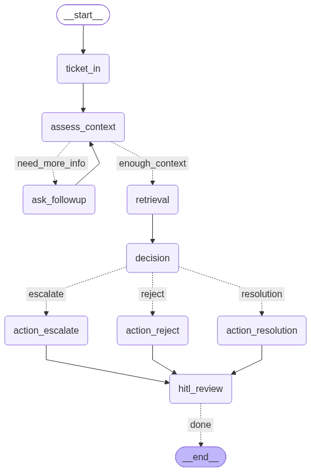

# Knowledge Base Support Agent

Built with **LangGraph**, **DeepSeek**, local **BGE** embeddings, and **MongoDB Atlas** hybrid retrieval.

| Guarantee | Behavior |
| --- | --- |
| Draft-only | Replies never auto-send |
| Grounded | Answers quote the Markdown knowledge base |
| No fabrication | Missing policy → escalate, do not invent |
| HITL gate | Approve / edit / reject / regenerate / escalate |
| Auditable | Append-only JSONL under `outputs/audit/` |

---

## LangGraph flow




**What each stage does**

| Node | Role |
| --- | --- |
| `ticket_in` | Entry node: seeds `followup_count`, publishes `ticket_received` on the in-process status bus (SSE to the customer UI). |
| `assess_context` / `ask_followup` | DeepSeek structured output (`ContextAssessment`): enough context vs missing fields. Follow-ups use LangGraph `interrupt()` until the customer replies; loops until enough or `max_followups` (config). |
| `retrieval` | LLM query expansion → Atlas `$vectorSearch` (BGE `embedd`, 384-d) + metadata/keyword search → Reciprocal Rank Fusion → `final_top_k` chunks + citation view on state. |
| `decision` | Structured triage over retrieved passages + injected escalation MD + inline reject scope → `escalate` \| `reject` \| `resolution`, confidence score, cited chunk ids. |
| `action_*` | Separate draft nodes (DeepSeek structured `ActionDraft`): grounded customer reply, refuse script, or internal escalate note; never sends email. |
| `hitl_review` | LangGraph `interrupt()` with draft, citations, low-confidence flag; resumes via `Command(resume=…)` for approve / edit / reject / regenerate / escalate. |


---

## Quick start

### 1. Prerequisites

- Python 3.11+
- MongoDB Atlas cluster with a vector search index on the documents collection
- DeepSeek API key

### 2. Environment

```powershell
python -m venv .venv
.\.venv\Scripts\Activate.ps1
pip install -r requirements.txt
copy .env.example .env
```

Fill `.env` (minimum):

```env
DEEPSEEK_API_KEY=sk-...
MONGODB_URI=mongodb+srv://...
```


### 3. Knowledge base → Atlas

```powershell
python -m src.retrieval.ingest             # chunk MD → MongoDB
python -m src.retrieval.embed              # write BGE vectors to embedd
```

Smoke checks:

```powershell
python -m src.main --show-config
python -m src.retrieval.vector_search "How long do I have to return an item?"
python -m src.retrieval.run_pipeline
```

### 4. Run locally

```powershell
.\.venv\Scripts\Activate.ps1
python -m src.main --serve
```

| Surface | URL |
| --- | --- |
| Customer chat | http://127.0.0.1:8000/ |
| Agent HITL | http://127.0.0.1:8000/agent |
| Health | http://127.0.0.1:8000/api/health |

Dev reload:

```powershell
python -m src.main --serve --reload
```

### 5. Tests

```powershell
pytest -q
```

## Repository layout

```
config/                 # YAML: app, models, routing
data/knowledge_base/    # Policy Markdown
docs/support_graph.png  # Compiled LangGraph diagram
frontend/               # Customer + agent static UIs
src/
  agents/               # Graph node implementations
  api/                  # FastAPI + ticket runner
  graph/                # State + graph wiring
  logging/              # JSONL audit
  queue/                # Live status events
  retrieval/            # Ingest, embed, search, pipeline
  main.py               # CLI entry (--serve, --show-config)
tests/
outputs/audit/          # Per-ticket audit logs (runtime)
```

---

## Docs

- [Design documentation](docs/documentation.md) — architecture, retrieval, triage, HITL, and design choices
- [Demo walkthrough](docs/demo.md) — screenshot tour of a full ticket
- [Graph diagram](docs/support_graph.png)
- [Product checklist](project_specifications.md)
