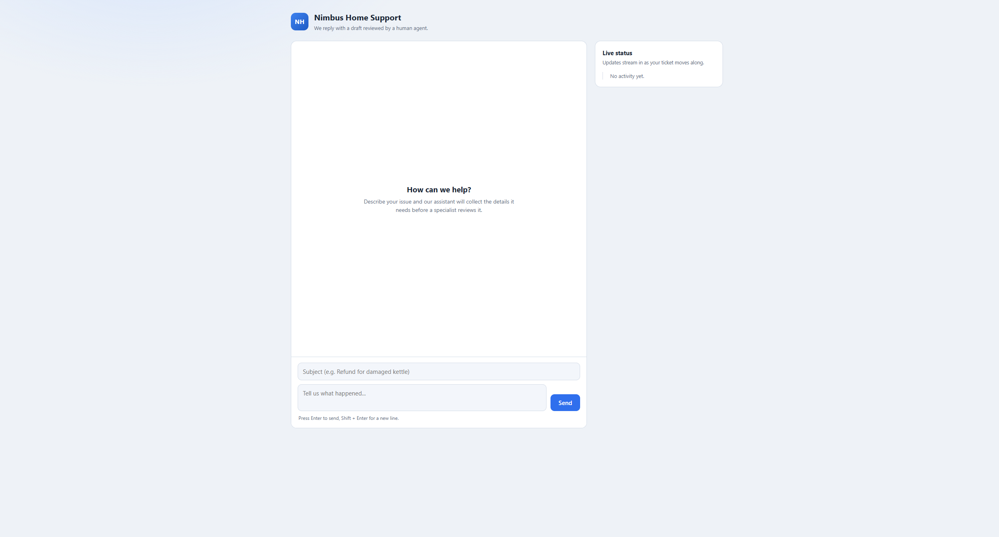
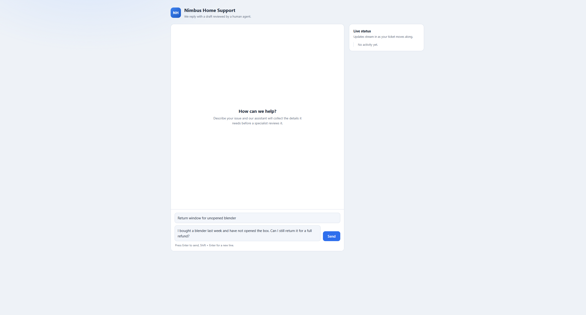
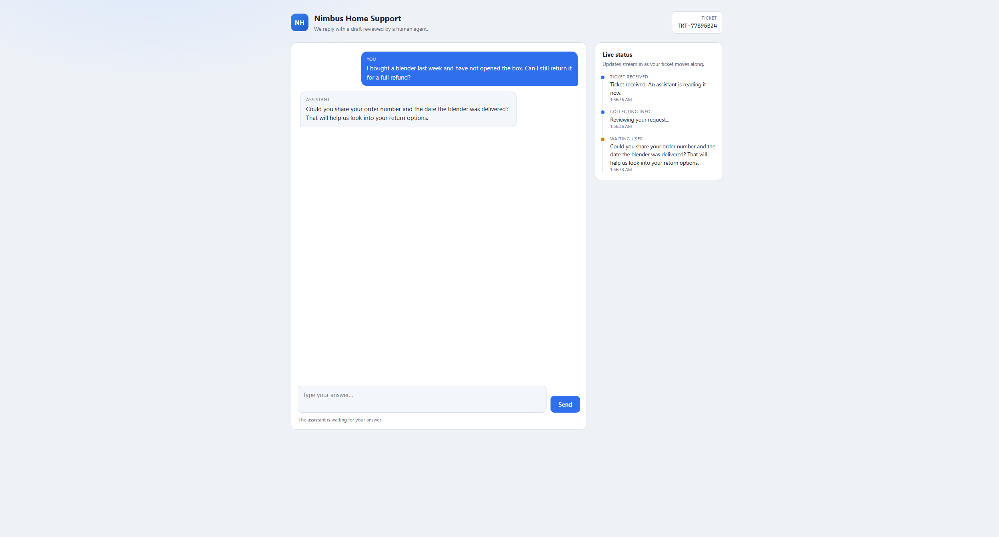
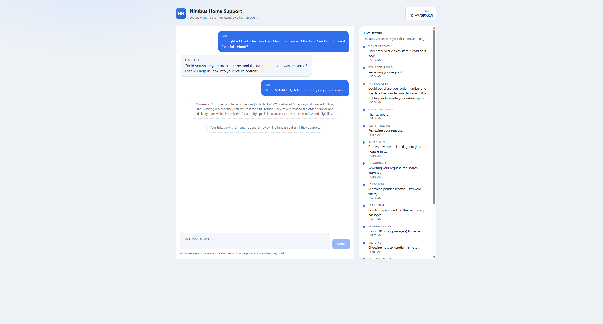
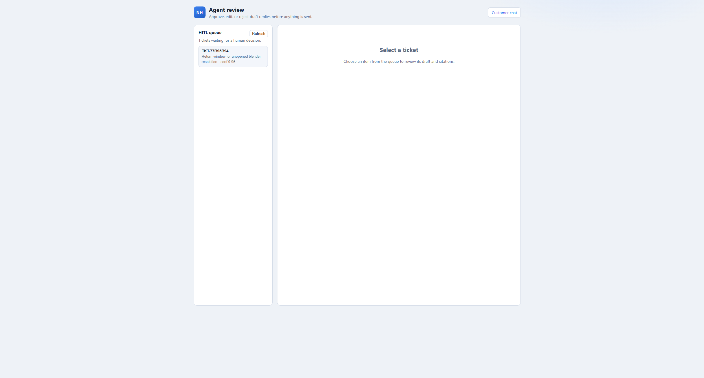
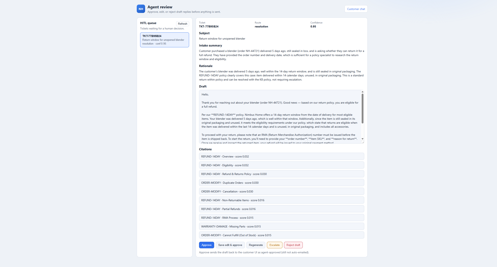
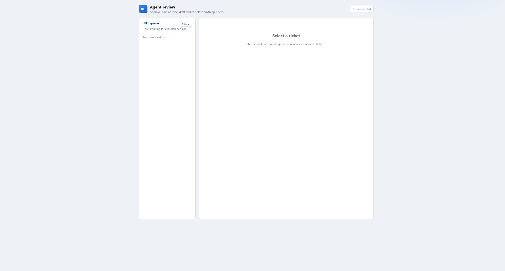
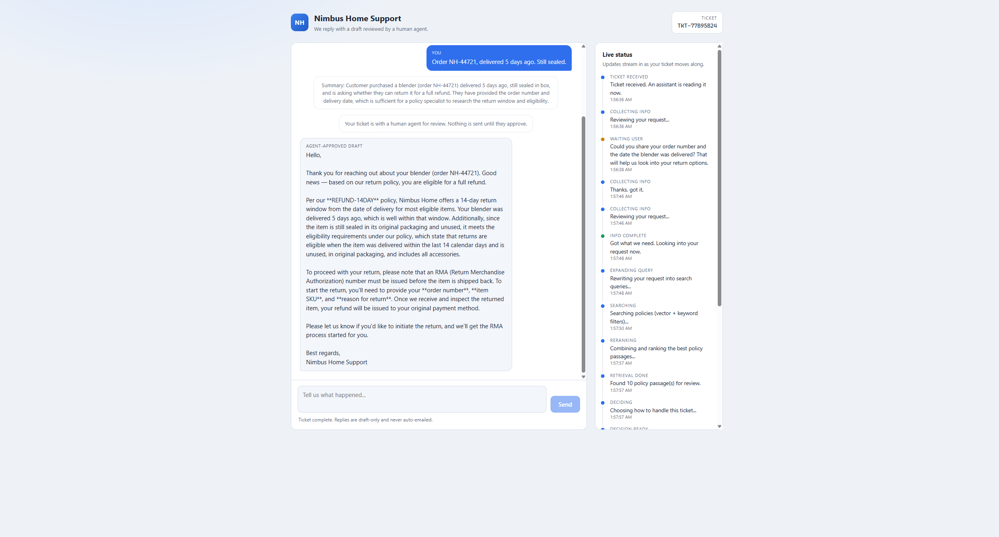

# Demo walkthrough

Screenshot tour of one end-to-end ticket (no video). Sample run: **TKT-77B95B24** — return window for an unopened blender → resolution draft → agent approve.

Prerequisites and run commands: [README](../README.md). Design notes: [documentation.md](documentation.md).

```powershell
.\.venv\Scripts\Activate.ps1
python -m src.main --serve
```

| UI | URL |
| --- | --- |
| Customer | http://127.0.0.1:8000/ |
| Agent HITL | http://127.0.0.1:8000/agent |

---

## 1. Customer — empty chat

Open `/`. Live status is idle until a ticket starts.



## 2. Customer — compose ticket

Subject + message (order details intentionally thin so intake asks a follow-up).



## 3. Customer — follow-up

Graph pauses at `ask_followup`. Status shows `waiting_user`.



## 4. Customer — pipeline + waiting for HITL

After the customer answers, status moves through expand → search → RRF → decision → draft. Composer locks; nothing is final until an agent acts.



## 5. Agent — HITL queue

Open `/agent`. Queue lists tickets in `waiting_hitl` with route + confidence.



## 6. Agent — review draft

Select the ticket: subject, intake summary, decision rationale, editable draft, KB citations, actions (approve / edit / regenerate / escalate / reject).



## 7. Agent — after approve

Ticket leaves the queue (`No tickets waiting`).



## 8. Customer — approved draft

Customer chat shows the **agent-approved draft** (still not auto-emailed). Status timeline retains the full pipeline.



---

## Graph (reference)


---

## What this demo proves

| Stage | Evidence in screenshots |
| --- | --- |
| Intake loop | Follow-up before retrieval |
| Hybrid RAG | Status: expanding / searching / reranking / retrieval done |
| Triage | Agent queue shows `resolution` + confidence |
| Grounding | Citations (`REFUND-14DAY`, …) on the review panel |
| HITL gate | Customer waits; approve unlocks the draft |
| Draft-only | Hint: never auto-emailed |

Audit trail for the sample ticket: `outputs/audit/TKT-77B95B24.jsonl`.
